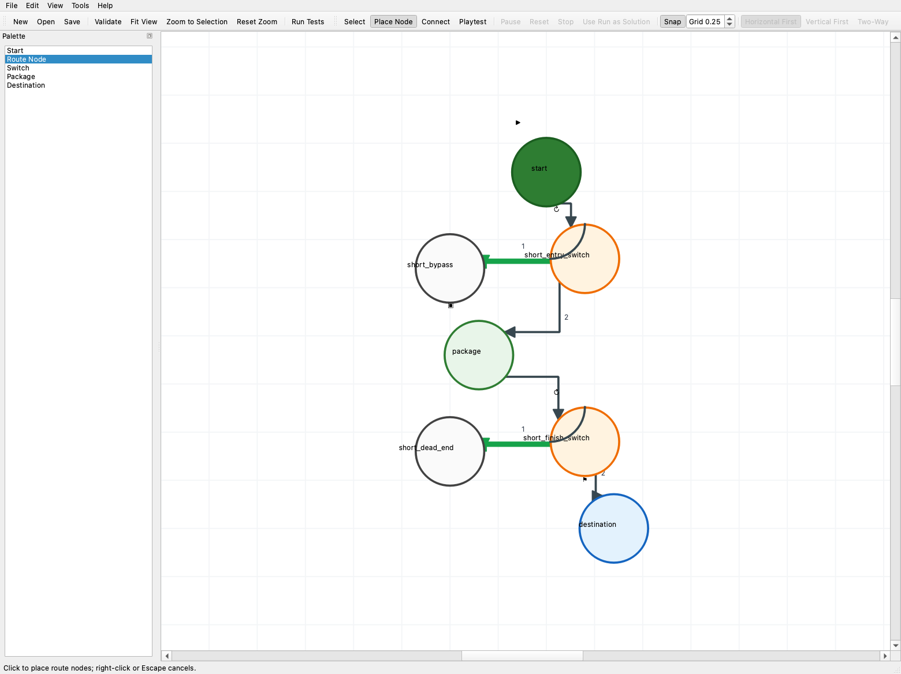
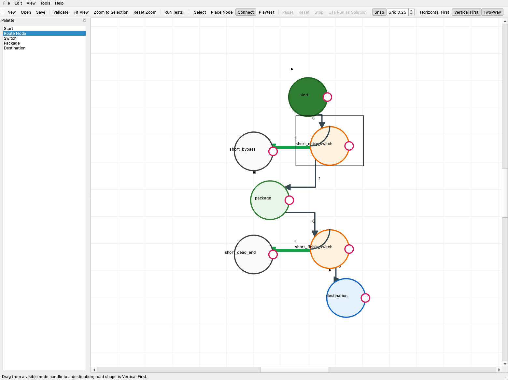
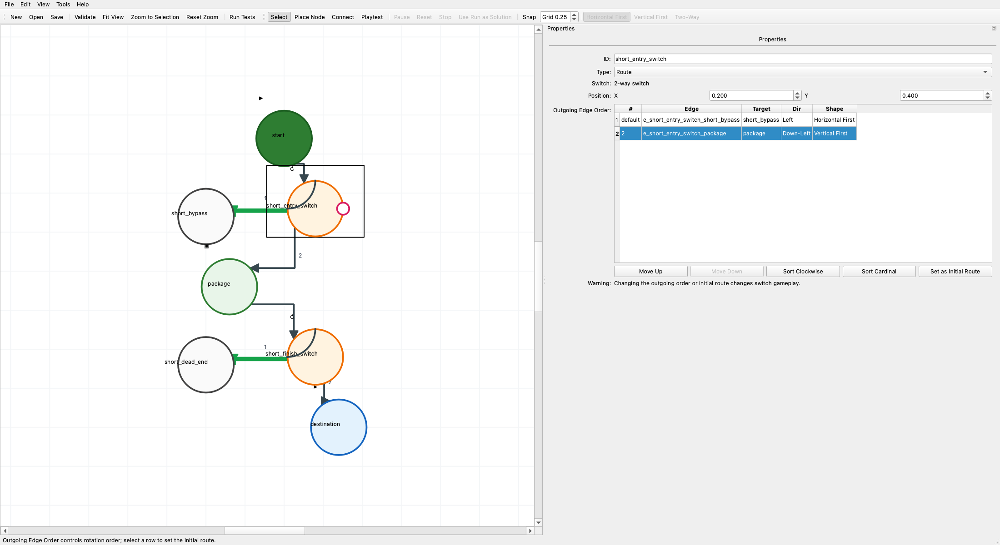
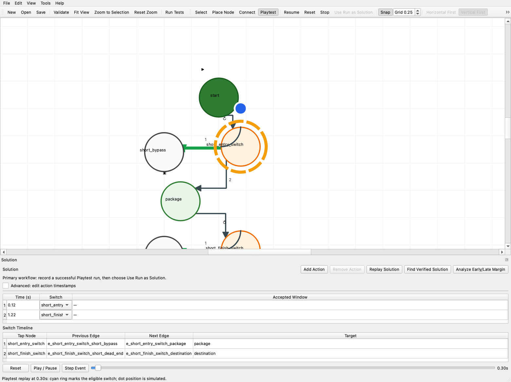
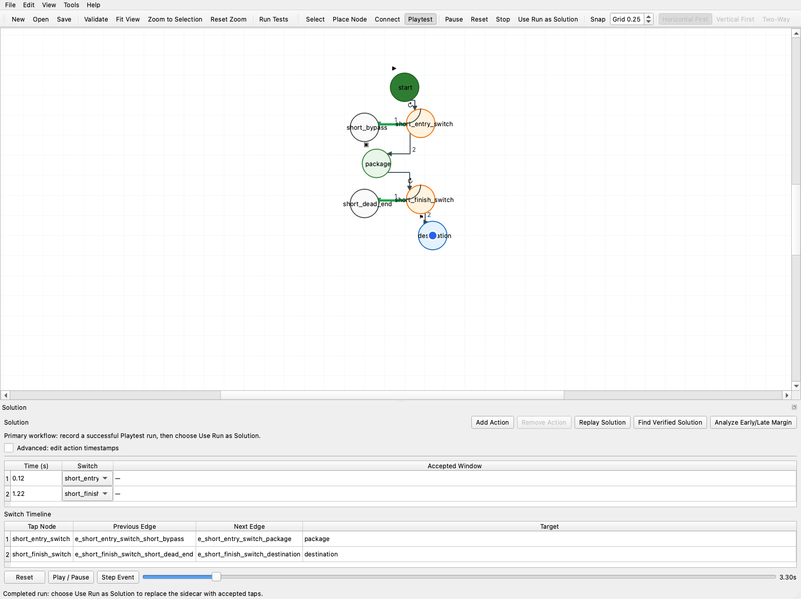
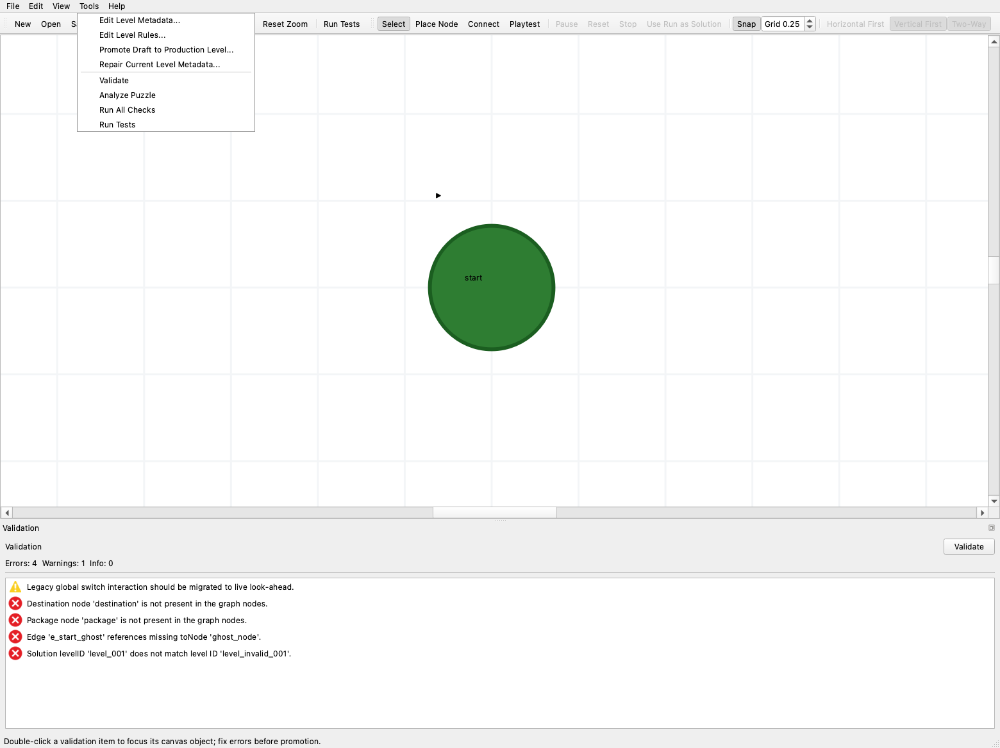

# Tiny Routes Level Editor User Guide

The Level Editor creates a level JSON document and its matching solution sidecar. Use the editor for direct manipulation and fast feedback; the Swift runtime remains the final gameplay authority.

## Install and launch

From the repository root:

```bash
python3 -m pip install -r Tools/LevelEditor/requirements.txt
python3 Tools/LevelEditor/run_level_editor.py
```

Open a known level and sidecar directly:

```bash
python3 Tools/LevelEditor/run_level_editor.py \
  --level TinyRoutes/Resources/Levels/level_010.json \
  --solution TinyRoutesTests/Resources/LevelSolutions/level_010.solution.json
```

The main modes are **Select** (`S`), **Place Node** (`N`), **Connect** (`C`), and **Playtest** (`P`). Press Escape to cancel the current operation or return to Select. Use the platform-standard undo and redo shortcuts (`Cmd+Z`/`Cmd+Shift+Z` on macOS and `Ctrl+Z`/`Ctrl+Y` on most other platforms).

## Place nodes

1. Choose **File > New Level** or open an existing draft.
2. Select a role in the Palette: Start, Route Node, Switch, Package, or Destination.
3. Click the canvas at the desired position. Keep clicking to place more nodes of the same role.
4. Right-click or press Escape to stop placing.
5. Enable **Snap** and choose a grid size when the level should align to the visible grid.

Dragging a palette item onto the canvas is an equivalent shortcut. A level can have only one start, package, and destination role; changing one of those roles updates the document references through an undoable command.



## Connect roads

1. Choose **Connect** (`C`). Connection handles appear on every node.
2. Select **Horizontal First** or **Vertical First** before drawing a bent road.
3. Drag from a source handle to the destination node. Clicking a source and then a destination in Connect mode is also supported.
4. Enable **Two-Way** before connecting when the editor should create both directed edges.
5. Select a road afterward to edit its ID, endpoints, shape, and availability in Properties. Schema-3 roads can require or forbid completed objectives, limit active objective indices, and set a deterministic usage limit.

Road arrows show direction. For switch exits, the numbered labels show rotation order and the green road is the initial route. Undo removes the complete connect operation, including both directions of a two-way road.



## Set switch order and the initial route

A node is switchable when it has at least two usable outgoing edge IDs. Select it in **Select** mode and use **Outgoing Edge Order** in Properties:

- **Move Up** and **Move Down** set the exact rotation sequence.
- **Sort Clockwise** orders exits by their displayed direction around the node.
- **Sort Cardinal** uses Up, Up-Right, Right, Down-Right, Down, Down-Left, Left, Up-Left.
- **Set as Initial Route** moves the selected exit to row one.

Row one is labeled `default`; it is the route used before any accepted tap. Each accepted tap rotates to the next currently usable outgoing road. Reordering can change the required tap count and invalidate a saved solution, so replay and validate afterward.



## Edit level rules and metadata

Use **Tools > Edit Level Rules** for schema version, interaction mode, look-ahead seconds, and tap cooldown. The editor authors schema version 2 `liveLookahead` content. When an archived version-1 level is opened, `Legacy Global (archive only)` is displayed as a disabled compatibility value; choose **Live Look-ahead** to migrate it.

Use **Tools > Edit Level Metadata** for the production number/ID, name, time limit, and par taps. The level ID, level filename, and sidecar `levelID` must agree.

## Playtest

1. Choose **Playtest** (`P`). Editing controls are disabled while the simulator owns the canvas.
2. Watch the blue dot move along the active route. The segmented ring marks the one switch currently eligible under live look-ahead.
3. Click that switch to rotate it. Rejected taps do not become solution actions; the status bar explains the rejection.
4. Use **Pause/Resume**, **Reset**, or **Stop** as needed.

To inspect a saved solution deterministically, choose **Replay Solution** in the Solution panel. Use the timeline slider, **Step Event**, and **Play / Pause** to examine the dot, eligible switch, active edges, and package state at a precise time.



## Record a solution

1. Reset or start a fresh Playtest run.
2. Complete the level by collecting the package and reaching the destination within the time limit.
3. Choose **Use Run as Solution**. The action is enabled only when the run completed and replays successfully.
4. The editor replaces the sidecar actions with accepted taps, sets `maxTaps`, and validates the result.
5. Choose **Analyze Early/Late Margin** to inspect accepted windows. Use advanced timestamp editing only for deliberate diagnostics; recording is the normal workflow.

Rejected clicks are excluded from the recorded solution. Save the draft after the new solution passes validation.



## Resolve validation issues

Validation updates automatically after edits, with a short debounce. Choose **Validate** for an immediate Python check.

- Errors block a production-ready result.
- Warnings identify migration or design risks that need review.
- Info messages are non-blocking guidance.

Double-click a message to select its related node or road. Related items are outlined on the canvas; area problems appear as red dashed overlays. Fix the underlying document, then validate again—the overlay is replaced rather than accumulated.

Use **Tools > Run All Checks** for structure, verified-solution search, saved replay, front-load diagnosis, decision-quality analysis, and Swift parity. **Run Tests** invokes the Swift solvability harness for a saved production level.



## Save a draft and promote it

1. Choose **File > Save Draft**. Drafts default to `docs/generated_levels/editor_drafts` and cannot be written directly into the production Levels directory.
2. Validate, complete a recorded playtest, and run the appropriate automated checks.
3. Choose **Tools > Promote Draft to Production Level**.
4. Select the production level number and review the derived `level_###` ID, name, time limit, and par taps.
5. Confirm any existing level/solution overwrite.
6. Choose **Save**. Promotion assigns the production paths and metadata; Save writes both the level and solution files.
7. Run **Run Tests** and the repository production-content checks before committing.

Production locations are:

- Level: `TinyRoutes/Resources/Levels/level_###.json`
- Solution: `TinyRoutesTests/Resources/LevelSolutions/level_###.solution.json`

Unknown extension fields are preserved on load/save. Candidate quality data is kept with non-production drafts and shown in Puzzle Analysis when the generator opens a candidate bundle.

## Useful canvas controls

- Shift-click toggles items in a multi-selection; drag on empty canvas for a marquee.
- Arrow keys nudge selected nodes by `0.05`; Shift+Arrow uses `0.25`.
- **Edit > Align Selected** and **Distribute Selected** apply one undoable arrangement.
- Middle-drag, or Space+left-drag, pans the canvas.
- **Fit View**, **Zoom to Selection**, and **Reset Zoom** restore useful framing.
- **Help > Keyboard Shortcuts** lists the complete shortcuts.

If the editor closes uncleanly while dirty, the next launch offers its recovery bundle. Recovery never overwrites the original level automatically.
